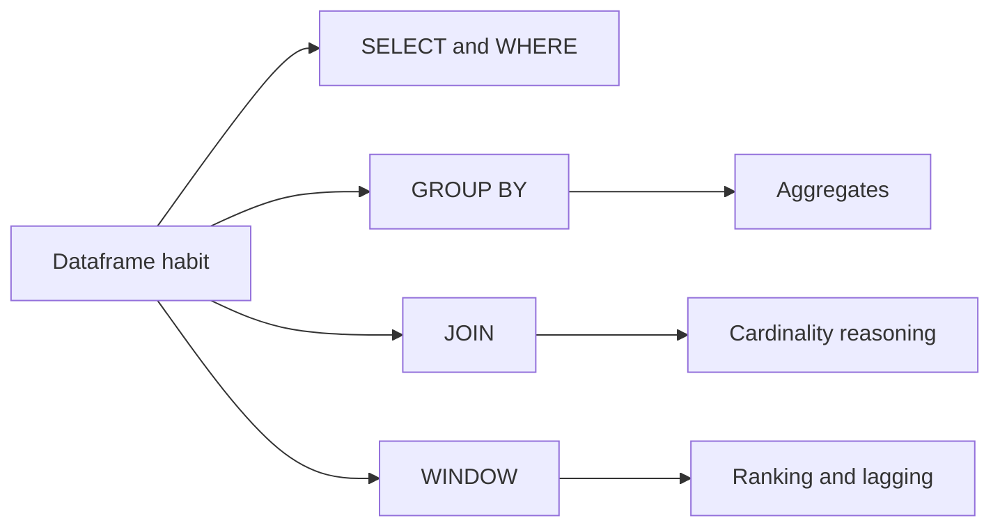

# SQL thinking map

Use this map when teaching that dataframe operations often translate into query clauses, not line-by-line code steps.

```mermaid
flowchart LR
  A["Dataframe habit"] --> B["SELECT and WHERE"]
  A --> C["GROUP BY"]
  A --> D["JOIN"]
  A --> E["WINDOW"]
  C --> F["Aggregates"]
  D --> G["Cardinality reasoning"]
  E --> H["Ranking and lagging"]
```
